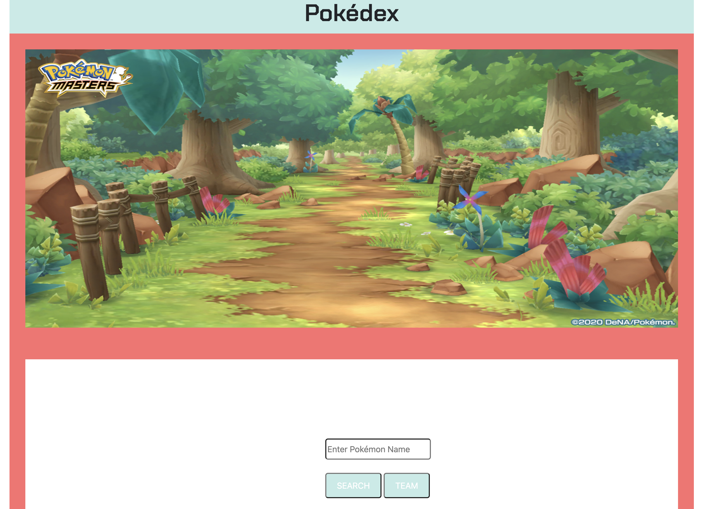
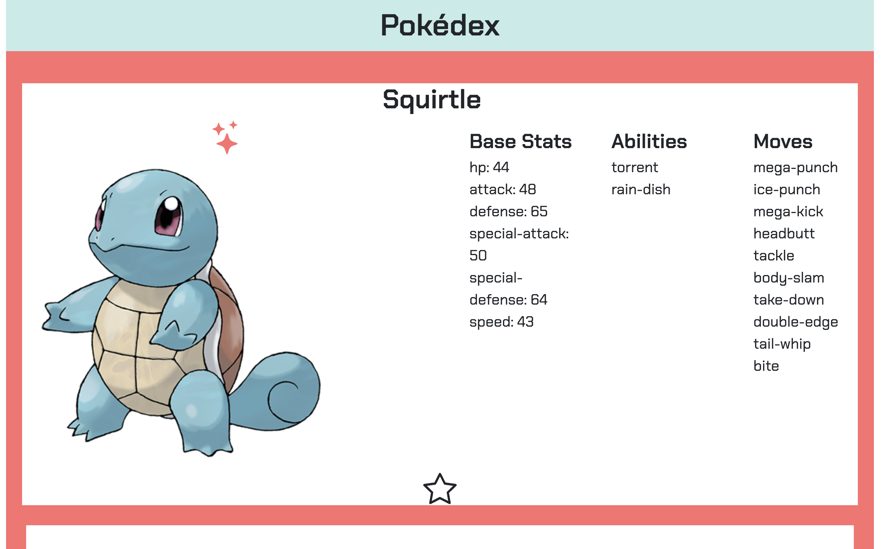

# pokedex

A web application for pokemon trainers who want to keep track of all their pokemon encounters.

## Why I Built This

I wanted to build a useful application for fans and owners of pokemon.

## Technologies Used

- HTML5
- CSS3
- Javascript

## Live Demo

Try the application live at [cindy-le91.github.io/pokedex/]

## Features

- User can search for pokemon.
- User can add pokemon to pokedex.
- User can view pokemon in pokedex.
- User can update image view of pokemon.
- User can delete pokemon from pokedex.

